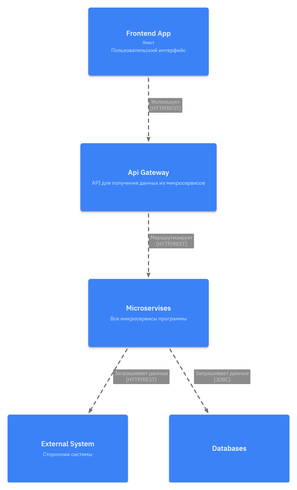
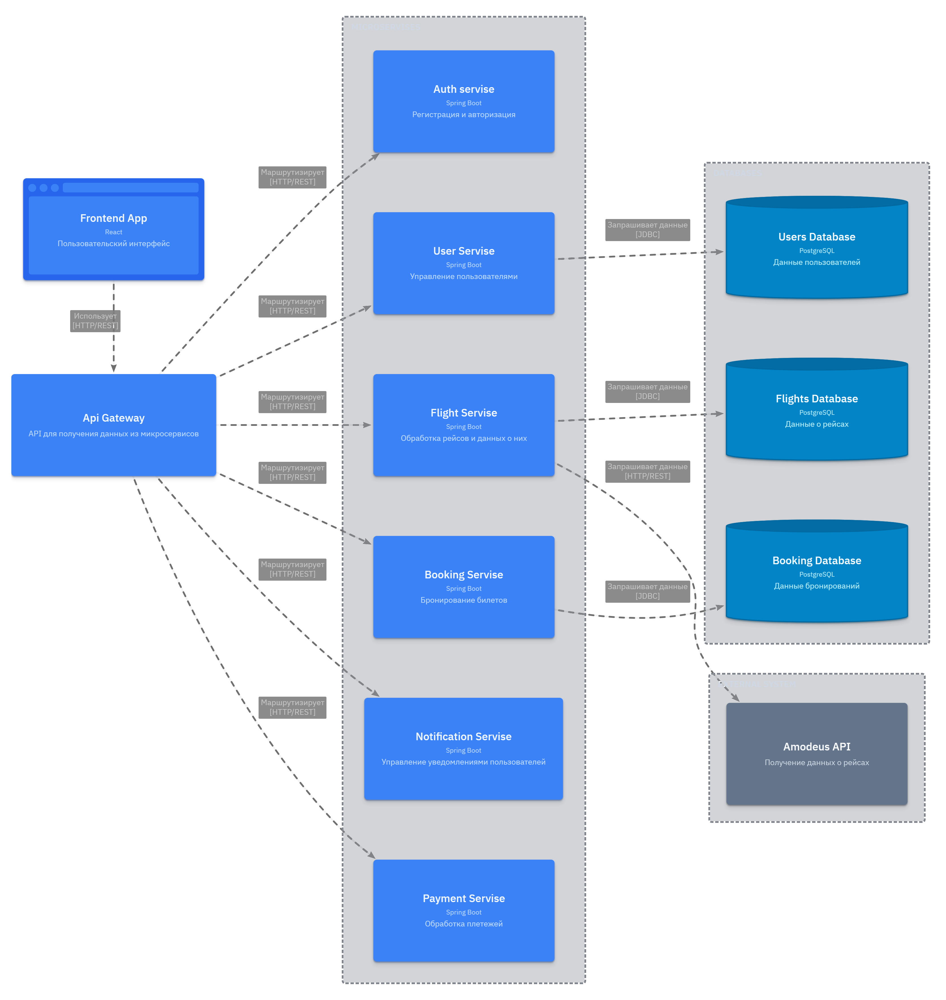

# Обоснование выбора архитектуры

## Выбор микросервисной архитектуры

Выбрал микросервисную архитектуру, так как она лучше всего подходит для высоконагруженного приложения, которое может потребовать масштабирования или появления новых фич.

## Основные принципы реализации

Для реализации данной архитектуры были приняты следующие решения:

- Каждый сервис для которого необходима БД имеет своё собственное хранилище, а не делит его с остальными
- Данные из внешнего источника обрабатываются отдельным сервисом
- Каждый из сервисов выполняет наименее возможное количество задач и не пересекаются в выполнении с другими сервисами

## Используемые технологии

### Основные компоненты
- Frontend: React 
- Backend Services: Spring Boot 
- Database: PostgreSQL 
- Внешний сервис: Amadeus API 

### Протоколы связи
- От сервиса к сервису: HTTP/REST
- Работа с БД: JDBC

